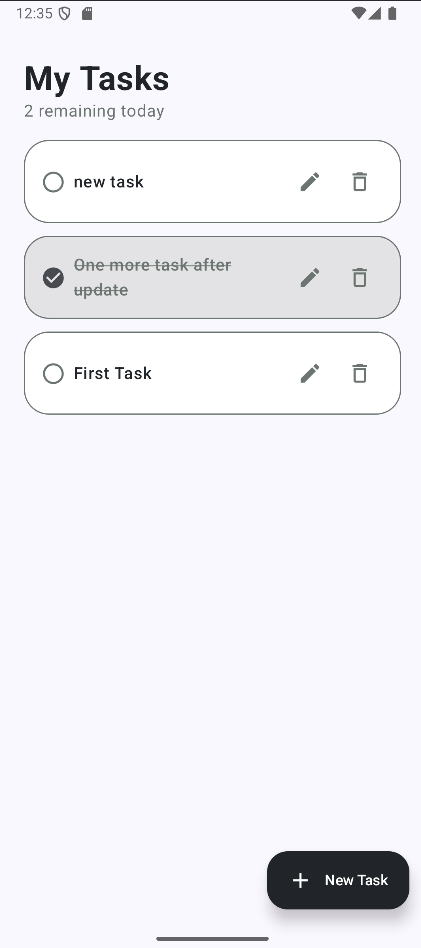
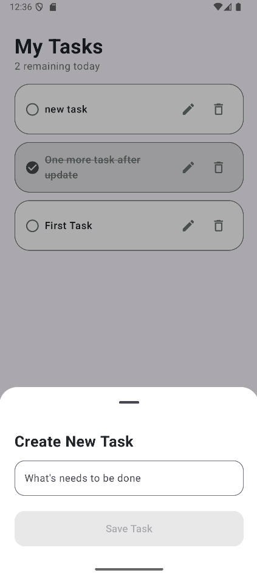
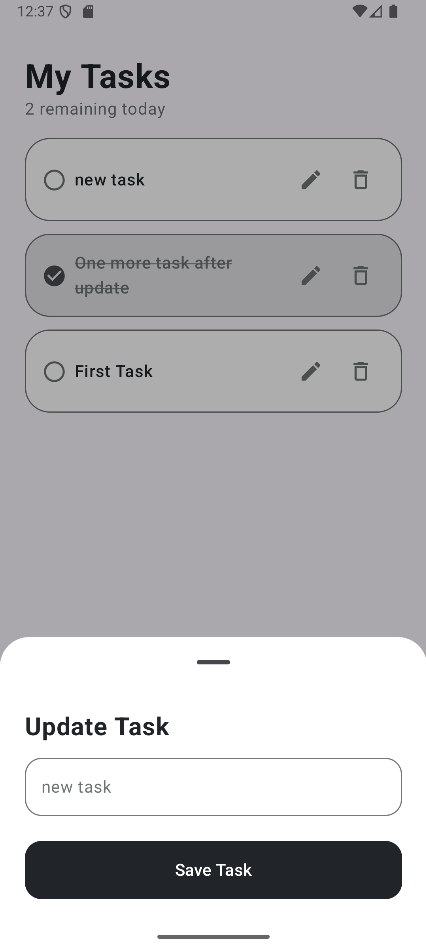

# ✅ ToDoApp

A clean, offline-first To-Do List Android app built with **Room Database** and **MVVM Architecture** — following modern Android development practices.

---

## What is ToDoApp?

ToDoApp is a minimal task manager that lets you add, edit, complete, and delete tasks — all stored locally on your device. No login, no cloud, no fluff. Built to understand how Room and MVVM work together in a real Android project.

---

## Features

- **Add Tasks** — Create new tasks via a bottom sheet
- **Edit Tasks** — Update any existing task inline
- **Complete Tasks** — Check off tasks with a strikethrough style
- **Delete Tasks** — Remove tasks with a single tap
- **Task Counter** — See how many tasks are remaining on the home screen
- **Offline First** — All data stored locally with Room. No account needed.

---

## Screenshots

| Home | Add Task | Update Task |
|---|---|---|
|  |  |  |

---

## Architecture

This app follows the **MVVM (Model-View-ViewModel)** pattern:

```
UI (Composables)
      ↕  observes LiveData
  ViewModel
      ↕  calls functions
  Repository
      ↕  queries
Room Database (DAO → Entity)
```

| Layer | Responsibility |
|---|---|
| **Entity** | Defines the Task data model / table schema |
| **DAO** | SQL operations — insert, update, delete, getAll |
| **Database** | Room database singleton |
| **Repository** | Bridges DAO and ViewModel; single source of truth |
| **ViewModel** | Exposes LiveData to UI; survives configuration changes |
| **UI** | Observes LiveData and renders the task list |

---

## Tech Stack

| Layer | Technology |
|---|---|
| Language | Kotlin |
| UI | Jetpack Compose |
| Architecture | MVVM |
| Local DB | Room |
| Async | Coroutines |

---

## Project Structure

```
com.example.todoapp/
├── data/
│   └── room_database/
│       ├── TaskDao.kt
│       ├── TaskDatabase.kt
│       └── TaskItem.kt
├── repository/
│   └── TaskRepository.kt
├── ui/
│   ├── screens/
│   │   ├── TaskEditor.kt
│   │   ├── TasksScreen.kt
│   │   └── ToDoItem.kt
│   └── theme/
│       ├── Color.kt
│       ├── Theme.kt
│       └── Type.kt
├── viewmodel/
│   ├── TaskViewModel.kt
│   └── TaskViewModelFactory.kt
└── MainActivity.kt
```

---

## Setup

```bash
git clone https://github.com/Vanshika-Tanwar/ToDoApp.git
```

Open in Android Studio, let Gradle sync, and run.

---

## What I learned building this

- How Room Database works — Entities, DAOs, and the Database singleton
- Repository pattern as a single source of truth between DAO and ViewModel
- ViewModel surviving configuration changes while keeping UI clean
- LiveData for reactive UI updates without manual refresh
- Running database operations off the main thread using Coroutines

---

## Author

[**Vanshika Tanwar**](https://github.com/Vanshika-Tanwar)
